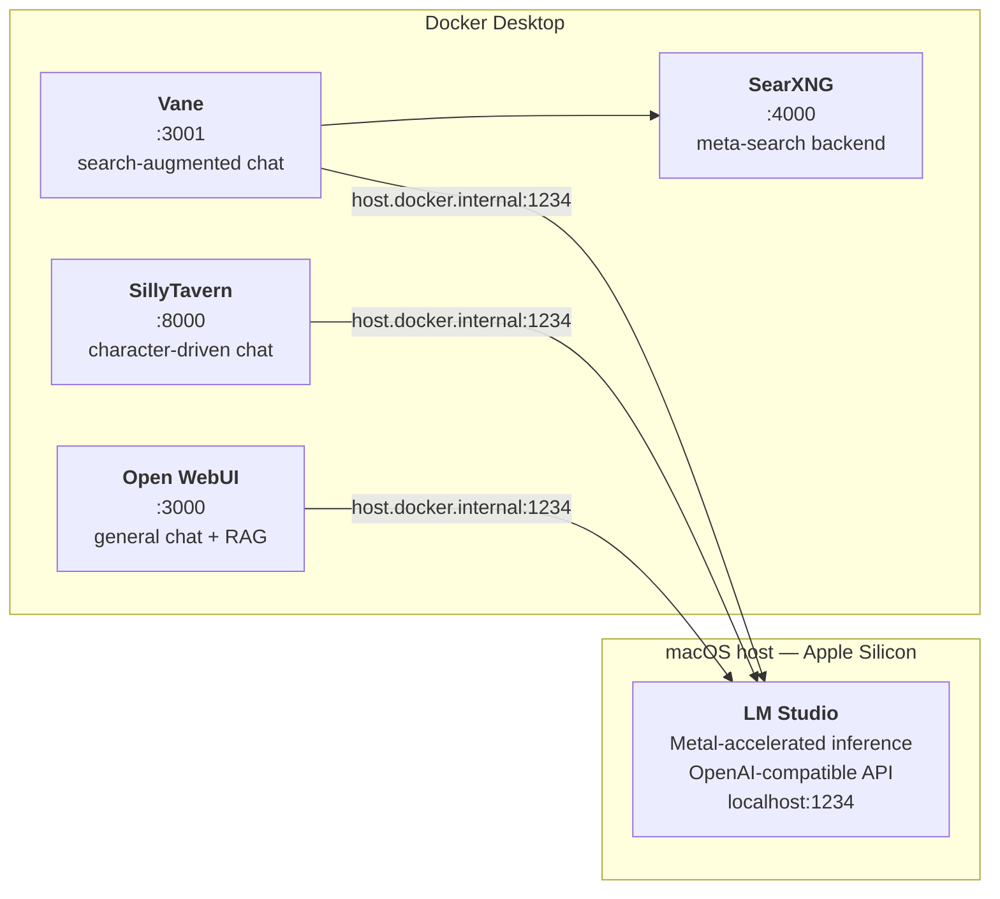

# lm-studio-docker-stack

A local LLM stack for Apple Silicon: **LM Studio** runs the models on Metal, **Docker** runs the chat interfaces, and everything talks over one OpenAI-compatible API on `localhost:1234`.

No cloud API keys. No fine-tuning. One backend, three front ends, and real numbers from a 16 GB machine.

---

## The stack



One model is loaded at a time. All three UIs point at the same API, so switching the loaded model in LM Studio changes what every interface serves.

<details>
<summary><b>Why a separate model server instead of one all-in-one app?</b></summary>

Each of these UIs *can* manage its own models. Letting them do so means three copies of the same multi-gigabyte weights on disk, three inference engines competing for the same unified memory, and three places to change a setting.

Running LM Studio as the single backend means the models live once at `~/.lmstudio/models/`, Metal acceleration is configured once, and the containers stay small and stateless — they hold chat history and settings, not weights. Swapping a model is one action in one app.

The tradeoff: LM Studio has to be running, and it's a GUI app rather than a service. That's the cost of the arrangement, and it's the right one for a laptop.

</details>

---

## Tested on

Canonical version matrix for this repo. Section READMEs point back here rather than repeating it.

| Component | Version |
|-----------|---------|
| Hardware | MacBook Pro, M1 Pro, 16 GB unified memory |
| macOS | Tahoe 26.5.1 (build 25F80) |
| LM Studio | 0.4.15+2 |
| Docker Desktop | 4.47.0 |
| Docker Engine | 28.4.0 |
| Docker Compose | v2.39.4-desktop.1 |
| Open WebUI | `ghcr.io/open-webui/open-webui:main` |
| SillyTavern | `ghcr.io/sillytavern/sillytavern:latest` |
| Vane | `itzcrazykns1337/vane:latest` |
| SearXNG | `searxng/searxng:latest` |

The container tags are moving targets — `:main` and `:latest` mean "whatever was current when the image was pulled," not a fixed release. Pin a digest if you need reproducibility across machines.

---

## Models

Four generative models, measured on the hardware above. Full methodology and raw data live in [`benchmarks/`](benchmarks/).

| Model | Format | RAM | Speed | Context | Reach for it when |
|-------|--------|-----|-------|---------|-------------------|
| Ministral 3 3B | GGUF Q4_K_M + vision | 8.57 GB | 52.4 tok/s | 256K (run at 64K) | You want an answer fast |
| DeepSeek R1 8B | MLX 4-bit | 4.87 GB | 33.8 tok/s | 32K | Reasoning, debugging, or you need RAM for other apps |
| GLM 4.6V Flash | MLX 4-bit | 7.13 GB | 25.7 tok/s | 128K (run at 64K) | Screenshots, OCR, diagrams |
| Gemma 2 9B | GGUF Q4_K_M | 8.16 GB | 20.5 tok/s | 8K | Response quality matters more than speed |

The most interesting row is DeepSeek R1: an 8B model in MLX 4-bit uses **less memory than a 3B in GGUF**. Quantization format matters more than parameter count on Apple Silicon. That single fact reshapes how you pick models for a 16 GB machine.

A fifth model — `nomic-embed-text-v1.5` — powers retrieval in Open WebUI and Vane. It ships bundled with LM Studio under `~/.lmstudio/.internal/bundled-models/`, so it never appears in the models directory and doesn't need downloading. It has no meaningful tokens/sec figure and isn't benchmarked; see [`model-selection-guide.md`](model-selection-guide.md).

---

## Quick start

**1. Start the model server.** Install LM Studio, download one model, and enable the local server (`Developer` → server on, port `1234`). Details and settings worth changing: [`lm-studio/`](lm-studio/).

**2. Start a UI.** Each service is an independent Compose file — run only the ones you want.

```bash
cd open-webui
docker compose up -d
```

Then open <http://localhost:3000>.

Ports and data paths are environment variables with sensible defaults, so a conflict on `3000` doesn't mean editing YAML:

```bash
OPEN_WEBUI_PORT=3010 docker compose up -d
```

**3. Point it at the model server.** The containers reach the host through `host.docker.internal`, not `localhost` — inside a container, `localhost` is the container. Every Compose file here sets `--add-host=host.docker.internal:host-gateway` for you. This is the single most common failure in this setup; [`troubleshooting.md`](troubleshooting.md) covers it and the rest.

---

## Repo layout

| Path | What's in it |
|------|--------------|
| [`lm-studio/`](lm-studio/) | Install, JIT model management, API server configuration |
| [`open-webui/`](open-webui/) | General-purpose chat with RAG — the default choice |
| [`sillytavern/`](sillytavern/) | Character cards, personas, long-form roleplay |
| [`perplexica/`](perplexica/) | Search-augmented answers via Vane + a local SearXNG |
| [`benchmarks/`](benchmarks/) | Measured tokens/sec, and how to reproduce the numbers |
| [`model-selection-guide.md`](model-selection-guide.md) | Which model for which job, and why |
| [`troubleshooting.md`](troubleshooting.md) | Networking, ports, load failures, cold-start latency |

> **Note on naming:** Perplexica was renamed **Vane** upstream. The directory stays `perplexica/` to match the upstream project path and the search term most people still use; the tool is called Vane throughout the prose and the Compose file pulls `itzcrazykns1337/vane:latest`.

---

## Scope

In: running open-weight models locally on Apple Silicon, the Docker UI layer on top, and honest performance numbers for a 16 GB machine. Out: fine-tuning, cloud LLM APIs, vector-database pipelines beyond what Open WebUI ships, and image generation. Each service section explains what it's good at rather than arguing the others are worse.

<details>
<summary><b>Other platforms</b></summary>

**Linux.** The Docker half should work with little change — the Compose files already declare `host.docker.internal` via `host-gateway`, which is exactly what Linux needs. The LM Studio half is the open question: LM Studio ships a Linux build, but its Metal acceleration is Apple-specific, so the performance numbers here will not transfer. Swapping in Ollama as the backend is the likely path, since it exposes a compatible API on a different port. **Untested by this repo** — a PR with actual results would be welcome.

**Windows.** WSL2 plus Docker Desktop is the plausible route, with the same backend caveat and additional networking differences between WSL and the Windows host. **Untested by this repo.**

**Intel Macs.** The Compose files are architecture-agnostic. The MLX models are not — MLX is Apple-Silicon-only, so the two MLX entries in the model table have no Intel equivalent. GGUF models will run on CPU, considerably slower.

</details>

---

## License

MIT — see [LICENSE](LICENSE).
