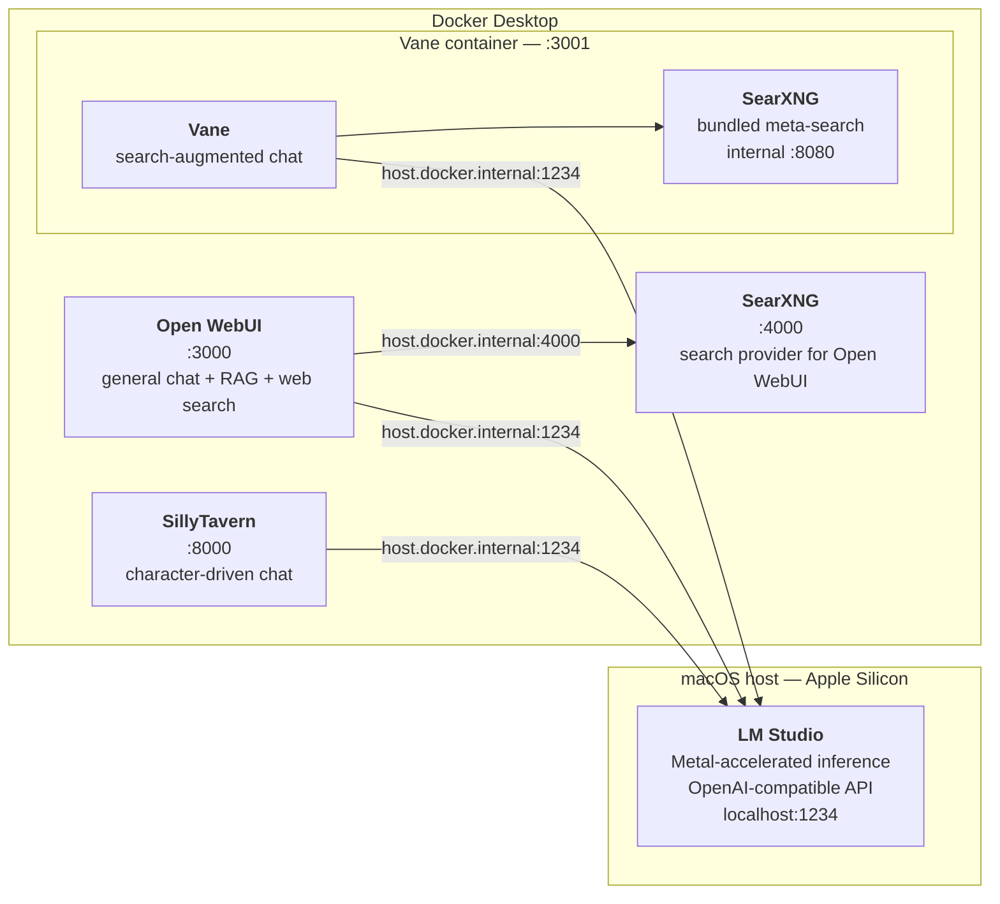

# lm-studio-docker-stack

A local LLM stack for Apple Silicon: **LM Studio** runs the models on Metal, **Docker** runs the chat interfaces, and everything talks over one OpenAI-compatible API on `localhost:1234`.

No cloud API keys. No fine-tuning. One backend, three front ends, and real numbers from a 16 GB machine.

---

## The stack



All three chat UIs point at the same API, so switching the loaded model in LM Studio changes what every interface serves. Models do not swap automatically — loading a second one leaves the first resident, and memory is reclaimed by an idle timeout rather than by eviction. See [`lm-studio/`](lm-studio/).

Two SearXNG instances appear, and they are deliberately separate. Vane's runs *inside* its container — the image starts its own on an internal port and points at it by default, so Vane's search backend needs no separate service. The standalone one on `:4000` exists for Open WebUI's built-in web search, which has no bundled backend of its own; it's optional, and [`web-search/`](web-search/) covers when it earns its place over the zero-config provider.

<details>
<summary><b>Why a separate model server instead of one all-in-one app?</b></summary>

Each of these UIs *can* manage its own models. Letting them do so means three copies of the same multi-gigabyte weights on disk, three inference engines competing for the same unified memory, and three places to change a setting.

Running LM Studio as the single backend means the models live once at `~/.lmstudio/models/`, Metal acceleration is configured once, and the containers stay small and stateless — they hold chat history and settings, not weights. Swapping a model is one action in one app.

The tradeoff: LM Studio has to be running, and it's a GUI app rather than a service. That's the cost of the arrangement, and it's the right one for a laptop.

</details>

---

## Tested on

Canonical version matrix for this repo. Section READMEs point back here rather than repeating it.

| Component | Version |
|-----------|---------|
| Hardware | MacBook Pro, M1 Pro, 16 GB unified memory |
| macOS | Tahoe 26.5.1 (build 25F80) |
| LM Studio | 0.4.15+2 |
| Docker Desktop | 4.47.0 |
| Docker Engine | 28.4.0 |
| Docker Compose | v2.39.4-desktop.1 |
| Open WebUI | `ghcr.io/open-webui/open-webui:main` |
| SillyTavern | `ghcr.io/sillytavern/sillytavern:latest` |
| Vane (SearXNG bundled) | `itzcrazykns1337/vane:latest` |

The container tags are moving targets — `:main` and `:latest` mean "whatever was current when the image was pulled," not a fixed release. Pin a digest if you need reproducibility across machines.

---

## Models

Four generative models, measured on the hardware above. Full methodology and raw data live in [`benchmarks/`](benchmarks/).

| Model | Format | On disk | Est. at 8K | Speed | Context | Reach for it when |
|-------|--------|---------|------------|-------|---------|-------------------|
| Ministral 3 3B | GGUF Q4_K_M + vision | 2.99 GB | 3.40 GiB | 50.7 tok/s | 256K (run at 64K) | You want an answer fast — or need to read a screenshot |
| DeepSeek R1 8B | MLX 4-bit | 4.62 GB | 6.02 GiB † | 36.0 tok/s | 32K | Reasoning, debugging, or you need RAM for other apps |
| GLM 4.6V Flash | MLX 4-bit | 7.09 GB | 9.25 GiB † | 30.3 tok/s | 128K (run at 64K) | Visual questions that need reasoning, not just reading |
| Gemma 2 9B | GGUF Q4_K_M | 5.76 GB | 6.73 GiB | 20.4 tok/s | 8K | A second opinion on a short prompt |

Every figure above is reproducible with one command. On-disk sizes come from `lms ls`; memory estimates from `lms load <key> -c 8192 --estimate-only`, which reports a conservative ceiling rather than a prediction; speeds from the harness in [`benchmarks/`](benchmarks/), measured on short answers and declining roughly 10% on long ones.

† LM Studio rates its estimates for MLX models `LOW` confidence, and those figures don't change with the context length requested — the KV cache isn't being modelled. Read them as weights-plus-overhead rather than a working set. GGUF estimates do scale with context, which is what makes the 8K comparison meaningful for the other two rows.

**Two of these reason before answering, and only one says so.** GLM 4.6V spent 77% of its response budget thinking on a chart question. Both it and DeepSeek R1 return an *empty* answer rather than a truncated one when the response limit is too low — budget 4,000 tokens minimum for either, even on questions whose answers are short. The thinking phase, not the answer, is what consumes the allowance.

**Memory is governed by context length, not parameter count.** At a matched 8K context the four models order exactly by size, with no shortcut hiding in the formats. The same 3B model estimates 3.40 GiB at 8K and 7.05 GiB at 64K — doubling from context alone. Cutting context frees more memory than switching to a smaller model usually does.

A fifth model — `nomic-embed-text-v1.5` — is the embedding model available to Open WebUI and Vane for retrieval. It ships bundled with LM Studio under `~/.lmstudio/.internal/bundled-models/`, so it never appears in the models directory and doesn't need downloading. It has no meaningful tokens/sec figure and isn't benchmarked.

Worth knowing that neither UI uses it by default — both download and run their own embedding model instead, which means retrieval quality is independent of whichever chat model you have loaded. See [`model-selection-guide.md`](model-selection-guide.md).

---

## Quick start

**1. Start the model server.** Install LM Studio, download one model, and enable the local server (`Developer` → server on, port `1234`). Details and settings worth changing: [`lm-studio/`](lm-studio/).

**2. Start a UI.** Each service is an independent Compose file — run only the ones you want.

```bash
cd open-webui
docker compose up -d
```

Then open <http://localhost:3000>.

Ports and data paths are environment variables with sensible defaults, so a conflict on `3000` doesn't mean editing YAML:

```bash
OPEN_WEBUI_PORT=3010 docker compose up -d
```

**3. Point it at the model server.** The containers reach the host through `host.docker.internal`, not `localhost` — inside a container, `localhost` is the container, so an endpoint pointing at `localhost:1234` fails silently with an empty model list. That's the most common configuration error here; [`troubleshooting.md`](troubleshooting.md) covers it and the rest.

Docker Desktop provides `host.docker.internal` on macOS without configuration. Every Compose file here also declares it via `host-gateway`, which is the Linux mechanism — so these files work unchanged on either platform.

---

## Repo layout

| Path | What's in it |
|------|--------------|
| [`lm-studio/`](lm-studio/) | Install, JIT model management, server and context configuration |
| [`open-webui/`](open-webui/) | General-purpose chat with RAG — the default choice |
| [`sillytavern/`](sillytavern/) | Character cards, personas, long-form roleplay |
| [`perplexica/`](perplexica/) | Search-augmented answers through a purpose-built UI |
| [`web-search/`](web-search/) | Open WebUI's built-in search, and what actually decides the answer |
| [`benchmarks/`](benchmarks/) | Measured tokens/sec, and how to reproduce the numbers |
| [`model-selection-guide.md`](model-selection-guide.md) | Which model for which job, and why |
| [`troubleshooting.md`](troubleshooting.md) | Networking, ports, load failures, cold-start latency |

> **Note on naming:** Perplexica was renamed **Vane** upstream. The directory stays `perplexica/` to match the upstream project path and the search term most people still use; the tool is called Vane throughout the prose and the Compose file pulls `itzcrazykns1337/vane:latest`.

---

## Scope

In: running open-weight models locally on Apple Silicon, the Docker UI layer on top, and honest performance numbers for a 16 GB machine. Out: fine-tuning, cloud LLM APIs, vector-database pipelines beyond what Open WebUI ships, and image generation. Each service section explains what it's good at rather than arguing the others are worse.

### Other backends

**Ollama** is the most common alternative to LM Studio, and the closest substitute in this stack: a compatible API on a different port, a CLI rather than a GUI, and similar Apple Silicon performance. It's the natural swap for anyone who wants the model server to run as a background service, which is the one thing LM Studio genuinely doesn't do. This repo hasn't benchmarked it, so no comparison of numbers is offered.

**llama.cpp** is the layer underneath — the inference engine LM Studio wraps for GGUF models, visible in this stack as the runtime version recorded alongside every measurement. Building it directly gives more control over quantisation and sampling and no GUI at all. Worth reaching for when you want the knobs; unnecessary when you don't.

**Apple MLX** is a different ecosystem rather than a lower layer — Apple's own array framework, and the format two of the models here ship in. Using it directly means writing Python, which is outside this stack's scope.

<details>
<summary><b>Other platforms</b></summary>

**Linux.** The Docker half should work with little change — the Compose files already declare `host.docker.internal` via `host-gateway`, which is exactly what Linux needs. The LM Studio half is the open question: LM Studio ships a Linux build, but its Metal acceleration is Apple-specific, so the performance numbers here will not transfer. Swapping in Ollama as the backend is the likely path, since it exposes a compatible API on a different port. **Untested by this repo** — a PR with actual results would be welcome.

**Windows.** WSL2 plus Docker Desktop is the plausible route, with the same backend caveat and additional networking differences between WSL and the Windows host. **Untested by this repo.**

**Intel Macs.** The Compose files are architecture-agnostic. The MLX models are not — MLX is Apple-Silicon-only, so the two MLX entries in the model table have no Intel equivalent. GGUF models will run on CPU, considerably slower.

</details>

---

## License

MIT — see [LICENSE](LICENSE).
