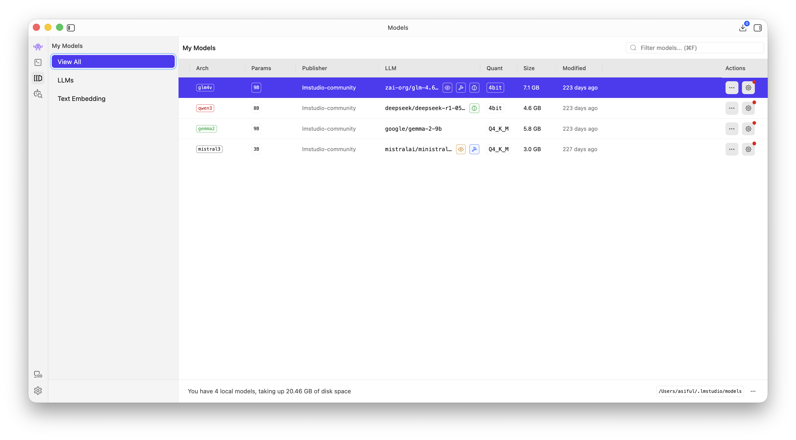
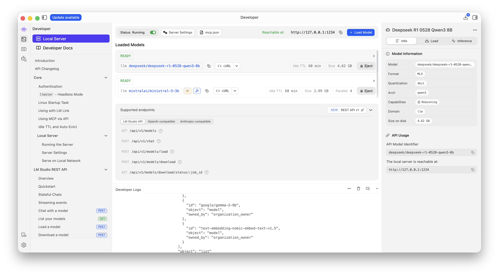

# LM Studio — the model server

Everything else in this stack is a front end. This is the part that actually runs the model.

LM Studio serves an OpenAI-compatible API on `localhost:1234`, so any client that speaks the OpenAI wire format points at it without modification. The models live here once, on disk, and every container in the stack shares them.

> See the [main README](../README.md) for the canonical tested-on version matrix.

---

## The thing that breaks everything

**The API server is not a background service.** LM Studio has to be running, and the server has to be explicitly started. Close the app and every container in this stack fails.

The failure is misleading. Open WebUI shows an empty model dropdown, SillyTavern reports a connection error, and Vane returns nothing — all of which look like Docker networking problems. They aren't. Check the server first:

```bash
lms server status
```

If it says the server is not running, that's the whole problem:

```bash
lms server start
```

<details>
<summary><b>Why isn't it a service?</b></summary>

LM Studio is a desktop application with an API attached, not a daemon with a GUI attached. Inference needs the GPU, and on macOS a background service doesn't get the same access to Metal that a foreground application does.

The practical consequence is that this stack has a startup order: LM Studio first, containers second. The containers will keep retrying, so starting them in the wrong order isn't fatal — it just looks broken until the server comes up.

</details>

---

## Install

Download from [lmstudio.ai](https://lmstudio.ai), or install through Homebrew if you prefer package-managed applications:

```bash
brew install --cask lm-studio
```

The CLI ships inside the application bundle at `~/.lmstudio/bin/lms` and is added to `PATH` on first launch. Confirm it resolved:

```bash
command -v lms
```

Everything below uses the CLI. The GUI does the same things — the CLI is documented here because it's scriptable, and because a command in a README is unambiguous in a way a screenshot of a settings tab is not.

---

## Starting the server

```bash
lms server start                    # default: port 1234, bound to 127.0.0.1
lms server status
lms server stop
```

Confirm it's actually serving:

```bash
curl -s http://localhost:1234/v1/models | jq -r '.data[].id'
```

Port, bind address, and CORS are all configurable — see [`server-config.md`](server-config.md), which also explains why binding to `0.0.0.0` deserves more caution than it usually gets.

---

## The models in this stack

Four generative models plus one embedding model. Model keys are the exact strings the API expects:

| Model key | Params | Format | On disk | Context used |
|-----------|--------|--------|---------|--------------|
| `deepseek/deepseek-r1-0528-qwen3-8b` | 8B | MLX 4-bit | 4.62 GB | 32K |
| `google/gemma-2-9b` | 9B | GGUF Q4_K_M | 5.76 GB | 8K |
| `mistralai/ministral-3-3b` | 3B | GGUF Q4_K_M + vision | 2.99 GB | 64K |
| `zai-org/glm-4.6v-flash` | 9B | MLX 4-bit | 7.09 GB | 64K |
| `text-embedding-nomic-embed-text-v1.5` | — | GGUF | 84 MB | — |



The sidebar's separate "Text Embedding" category is where the bundled embedding model appears — it isn't counted among the four local downloads.

List them yourself:

```bash
lms ls --llm
lms ls --embedding
```

**The embedding model is bundled.** It ships with LM Studio under `~/.lmstudio/.internal/bundled-models/` rather than the user models directory, so it never appears in the download browser and doesn't need fetching.

Worth noting that neither UI uses it by default — both Open WebUI and Vane bundle their own embedding model and run that instead. Retrieval works out of the box in both, just not through this model unless you point them at it.

<details>
<summary><b>Adding models from Hugging Face</b></summary>

LM Studio's model browser searches Hugging Face directly and downloads into `~/.lmstudio/models/`, so the usual workflow needs no separate tooling. Search by model name, and the browser shows available quantisations with an indication of which will fit your machine.

Two things worth knowing when choosing. Quantisation level is the main lever on both size and quality — Q4_K_M is the common default and what most models in this stack use. And on Apple Silicon, MLX builds where available are more memory-efficient than GGUF at comparable quality, though they're published for fewer models.

A model downloaded this way is loadable by `lms load` immediately, under the key shown in `lms ls`.

</details>

---

## Disk size is not memory size

This is the single most useful thing to understand before choosing models for a machine with limited memory.

Ministral 3B occupies **2.99 GB on disk**, and LM Studio estimates **7.05 GiB** for it at 64K context. The same model at 8K estimates **3.40 GiB** — the file hasn't changed, only the context window.

That's the lever. Context allocates memory whether or not you use it, and cutting it frees more than switching to a smaller model usually does.

Two things drive the gap:

**Context length allocates memory.** The KV cache scales with the context window, and at 64K it can exceed the weights themselves. Cutting context from 64K to 16K frees more memory than switching to a smaller model usually does.

**Quantization format matters on Apple Silicon.** MLX is Apple's own array framework, and MLX-quantized models are consistently more memory-efficient here than GGUF at comparable quality.

<details>
<summary><b>Prove it on your own machine</b></summary>

Load the same model at two context lengths and compare:

```bash
lms load deepseek/deepseek-r1-0528-qwen3-8b -c 8192 -y
lms ps
lms unload -a

lms load deepseek/deepseek-r1-0528-qwen3-8b -c 32768 -y
lms ps
lms unload -a
```

Same weights, same file, different memory footprint. The number in the `SIZE` column is the weights; the memory the process actually holds grows as the context fills during a conversation.

</details>

---

## Check whether a model fits before loading it

```bash
lms load deepseek/deepseek-r1-0528-qwen3-8b --estimate-only
```

This calculates the resource requirement without loading anything. Two caveats worth knowing:

**It reports a ceiling, not a prediction.** The estimate sits well above the weights it's estimating for — 6.02 GiB against 4.62 GB on disk for the 8B model. That's the right direction for a safety check to err, but it isn't a measurement of what the process holds.

**It reports its own confidence, and MLX estimates deserve scepticism.** A `LOW` rating means what it says. For MLX-format models the figure also doesn't change with the context length you pass, which means the KV cache isn't being modelled — the same model estimates identically at 8K and 32K. GGUF estimates do scale with context.

Find out what your accelerator budget actually is:

```bash
lms runtime survey
```

On the machine this repo was built against, that reports **11.84 GiB of Metal-accessible memory out of 16 GB system RAM**. That ceiling — not the total RAM — is the number that governs which models fit.

---

## Loading models from the CLI

```bash
lms load deepseek/deepseek-r1-0528-qwen3-8b -c 32768 --gpu max --ttl 3600 -y
lms ps
lms unload deepseek/deepseek-r1-0528-qwen3-8b
```

| Flag | Effect |
|------|--------|
| `-c, --context-length` | Context window in tokens. The main memory lever. |
| `--gpu` | Offload ratio: `off`, `max`, or `0`–`1`. Defaults to automatic. |
| `--ttl` | Unload after this many idle seconds. |
| `--parallel` | Concurrent predictions allowed. |
| `--identifier` | Custom name for API references. |
| `-y, --yes` | Non-interactive. Required for scripts. |

### Models accumulate — they don't swap

Just-in-time loading is often assumed to keep exactly one model resident, evicting the previous one whenever a request arrives for a different model. That is not what happens.

**Loading a second model leaves the first in memory.** This holds whether the second load is explicit or triggered by an incoming API request — a UI switching models mid-conversation stacks a second model on top of the first:

```
IDENTIFIER                            SIZE       CONTEXT
deepseek/deepseek-r1-0528-qwen3-8b    4.62 GB    32768
mistralai/ministral-3-3b              2.99 GB    65536
```



Measured on an ~11.8 GiB accelerator budget: an 8B model at 32K context plus a 3B at 64K sat at 7.61 GB together without complaint. A third would be tight, and the failure arrives as degraded performance before it arrives as an error.

What actually reclaims memory is the idle timeout, not eviction. Each loaded model carries its own TTL and unloads once it goes unused for that long. Set `--ttl` deliberately rather than relying on a swap that doesn't happen, and check `lms ps` when memory feels tight.

To reset:

```bash
lms unload -a
```

A bare `lms unload` with several models loaded prompts interactively, which makes it unsafe in a script. Always pass an identifier or `-a`.

---

## Inference runtimes

```bash
lms runtime ls
```

Two engines are active, one per model format — a `llama.cpp` Metal build for GGUF, and an MLX build for MLX models. Older versions accumulate as runtimes update, and can be cleared with `lms runtime remove`.

The runtime version belongs in any benchmark you publish. Tokens/sec figures aren't comparable across engine versions, which is why the [benchmarks](../benchmarks/) section records the exact runtime alongside every measurement.

---

## Activity Monitor won't show you model memory

Model weights load into a child process, not the main application process. Inspecting the process named "LM Studio" shows a small footprint — around 0.12 GB — while a multi-gigabyte model is loaded and serving.

Use the tool that knows:

```bash
lms ps
```

---

## Next

- [`server-config.md`](server-config.md) — port, bind address, CORS, and where each setting actually lives
- [`../open-webui/`](../open-webui/) — the first UI to point at this server
- [`../troubleshooting.md`](../troubleshooting.md) — when the containers can't reach the API
