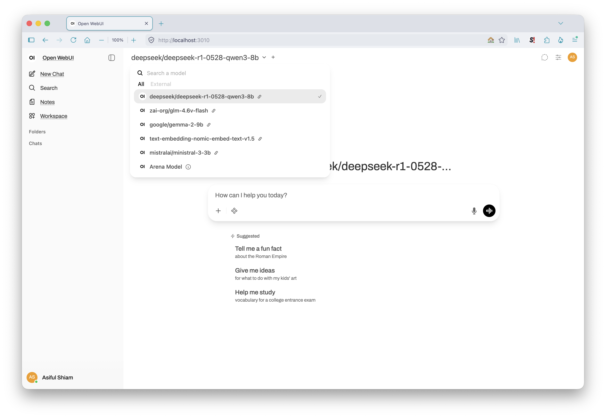

# Open WebUI

The default choice of the three interfaces in this stack. If you only run one, run this one.

It's a ChatGPT-style web UI with document retrieval, code execution, and chat organisation built in. Point it at LM Studio and every model you have loaded appears in the picker — no per-model configuration, no API keys to paste.

> See the [main README](../README.md) for the canonical tested-on version matrix.

---

## Start it

```bash
docker compose up -d
```

Then open <http://localhost:3000> and create an account. The first account registered becomes the administrator.

LM Studio must be running with its server started, or the model picker will be empty — see [`../lm-studio/`](../lm-studio/).

### First boot takes a few minutes

The container downloads its own embedding model on first start and reports `unhealthy` while doing so. This is normal and self-resolving. Watch it rather than restarting:

```bash
docker ps --filter name=open-webui --format '{{.Names}}\t{{.Status}}'
docker logs open-webui --tail 20
```

`Up N minutes (healthy)` means ready. The log line to wait for is `Application startup complete`. A few `Invalid HTTP request received.` entries along the way are just the browser probing before the app is serving — harmless noise, not errors.

Subsequent starts take seconds, because the download is cached in the data directory.

---

## The connection is already configured



Every model appears in the picker on first launch, without visiting a settings page. Two environment variables in the Compose file do that:

```yaml
- OPENAI_API_BASE_URL=${LM_STUDIO_URL:-http://host.docker.internal:1234/v1}
- OPENAI_API_KEY=${LM_STUDIO_API_KEY:-lm-studio}
```

`OPENAI_API_KEY` has to be non-empty even though LM Studio ignores its value — the client refuses to send requests without one.

<details>
<summary><b>Why <code>host.docker.internal</code> and not <code>localhost</code></b></summary>

Inside a container, `localhost` means the container itself. A request to `http://localhost:1234` from inside Open WebUI looks for a model server running *in that container*, finds nothing, and fails — the container starts perfectly and the model list is silently empty. Pointing an endpoint at `localhost` is the most common configuration error in this stack.

`host.docker.internal` resolves to the machine running Docker. Docker Desktop provides it on macOS and Windows without any configuration. The Compose file declares it anyway:

```yaml
extra_hosts:
  - "host.docker.internal:host-gateway"
```

`host-gateway` is the Linux mechanism, where the name isn't supplied automatically. Declaring it costs nothing on macOS and means this file works unchanged on Linux.

</details>

Configuring the connection through the UI instead would store it in the container's database rather than the Compose file — which works, until you move machines or start fresh and have to remember what you clicked. The environment variables make a clean `docker compose up` reproduce the whole setup.

---

## Configuration

Every setting is an environment variable with a default, so a port conflict doesn't mean editing YAML:

| Variable | Default | Purpose |
|----------|---------|---------|
| `OPEN_WEBUI_PORT` | `3000` | Host port |
| `OPEN_WEBUI_DATA` | `./open-webui-data` | Chats, settings, documents, vectors |
| `OPEN_WEBUI_NAME` | `open-webui` | Container name |
| `LM_STUDIO_URL` | `http://host.docker.internal:1234/v1` | Model server endpoint |
| `LM_STUDIO_API_KEY` | `lm-studio` | Placeholder; value is ignored |

```bash
OPEN_WEBUI_PORT=3010 docker compose up -d
```

Or put them in a `.env` file beside the Compose file — Compose reads it automatically, and the repo's ignore rules keep it out of git.

### Where the data lives

The default keeps everything in `./open-webui-data`, beside the Compose file. Self-contained, easy to move or delete, and excluded from version control.

For a permanent install, putting it outside the checkout is one variable:

```bash
OPEN_WEBUI_DATA=${HOME}/open-webui-data docker compose up -d
```

Either way it's a bind mount rather than a named volume, so the files are visible on the host and get picked up by whatever backs up your home directory. That directory holds every conversation, uploaded document, and vector index — back it up, or accept losing it.

---

## Retrieval

Document retrieval is the main reason to run Open WebUI rather than LM Studio's built-in chat window. Upload files, and the model answers from them with citations.

### It ships its own embedding model

Worth knowing, because it surprises people: on first boot the container downloads `all-MiniLM-L6-v2` and uses it for embeddings by default. It does **not** use LM Studio's bundled Nomic model unless you tell it to.

That default is a reasonable one — MiniLM is small, fast, runs inside the container, and doesn't compete with your chat model for memory. But it means retrieval quality is independent of which model you have loaded, which isn't obvious.

You can point embeddings at LM Studio instead, through the admin document settings, using the same OpenAI-compatible endpoint the chat models use and `text-embedding-nomic-embed-text-v1.5` as the model. Nomic is the larger and generally stronger embedding model; MiniLM is the lighter one. Worth trying both against your own documents rather than taking either as given — retrieval quality is corpus-dependent enough that the comparison is quick and the answer isn't universal.

<details>
<summary><b>On standalone vector databases</b></summary>

Open WebUI ships its own vector store and manages it for you — embedding, indexing, and retrieval all happen inside the container with no separate service to run. For a personal document collection that's the right amount of machinery.

Standalone vector databases like Chroma or Qdrant solve problems this doesn't have: sharing an index across applications, collections large enough to need real indexing strategies, or querying from your own code. They're out of scope here, and reaching for one before you've hit a limit of the built-in store adds a service to maintain for no gain.

</details>

### Web search

Retrieval's other half: instead of answering from documents you uploaded, the model generates search queries, fetches live results, and answers from those. Built in — no plugin, no API key, and with the zero-config provider, no extra container.

It gets its own section, because which settings you change decides whether it works at all: [`../web-search/`](../web-search/) covers the providers, the four settings that matter, and measured behaviour across every model in this stack. The short version: cap the result count, and treat it as a correctness setting rather than a throughput one.

The context dynamic below applies to web results doubly — fetched pages are far larger than document chunks, and they compete for the same window.

### Chunking and retrieval depth

Two settings govern most of the quality:

**Chunk size** determines how much text each embedded fragment holds. Around 1000 characters is a sensible starting point. Smaller chunks match more precisely but lose surrounding context; larger chunks preserve context but dilute the match and consume more of the model's window.

**Top-K** is how many chunks get retrieved per query. Three works well on an 8K–32K context model. Raising it feeds the model more material and burns context — on Gemma's 8K window, a high top-K crowds out the conversation itself.

The interaction with context length is the part worth internalising: retrieval competes for the same window as your chat history. A model at 8K context with generous chunks and a high top-K will start forgetting the conversation to make room for documents.

---

## Managing the container

```bash
docker compose up -d          # start
docker compose stop           # stop, keep the container
docker compose down           # stop and remove; data survives in the bind mount
docker compose logs -f        # follow logs
docker compose pull && docker compose up -d   # update to the latest image
```

`restart: unless-stopped` in the Compose file means the container comes back when Docker Desktop starts, unless you stopped it deliberately.

Updating pulls whatever `:main` currently points to. Data persists across updates, but the tag is a moving target — the [tested-on matrix](../README.md) records the version this repo was verified against.

---

## Scope

This section covers running Open WebUI against a local model server and the retrieval features that come with it. Authentication beyond the local admin account, multi-user deployment, and reverse-proxy setups are out — this is a single-user stack on a laptop. For connection failures and port conflicts, see [`../troubleshooting.md`](../troubleshooting.md).
