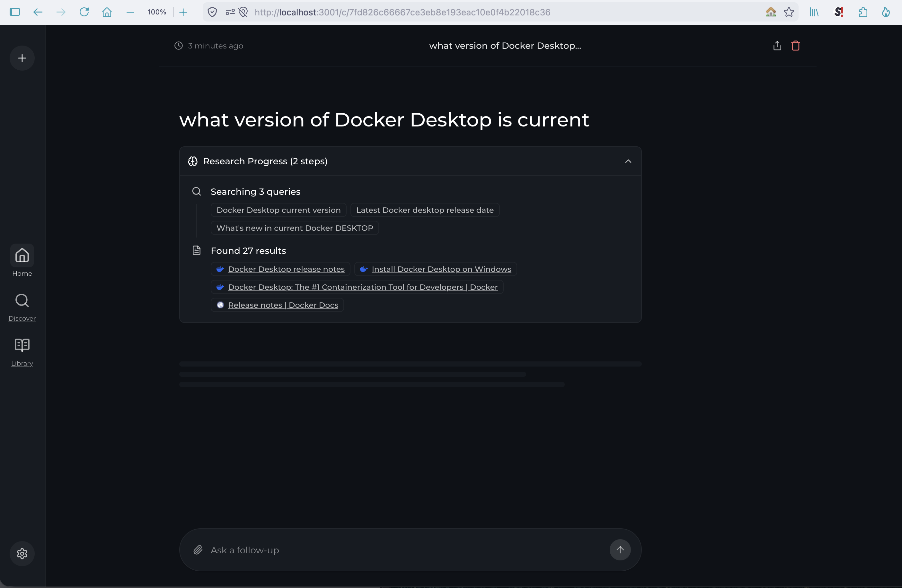
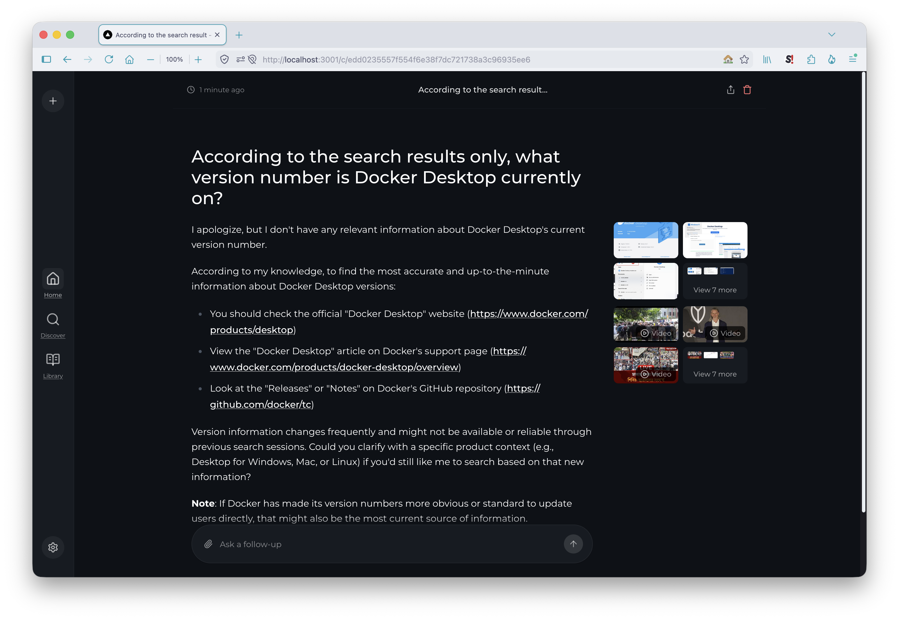
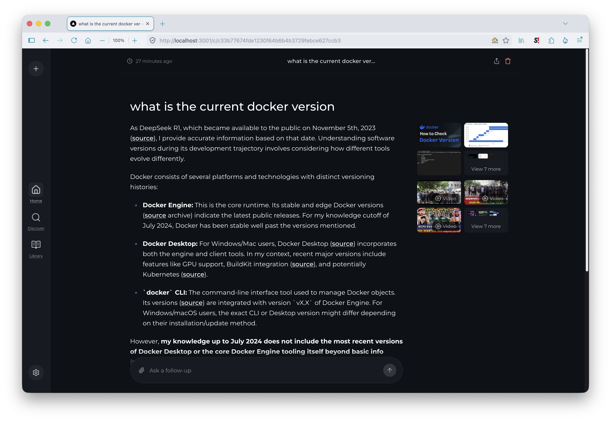

# Vane — search-augmented chat

Ask a question, and instead of answering from training data alone, the model generates search queries, retrieves web results, and synthesises an answer with citations. A local, self-hosted take on the search-plus-LLM pattern.

This is also the section where local models are pushed hardest, and where the honest answer is that a 16 GB laptop does not deliver the experience the architecture promises. That's documented below rather than skipped — it's the most useful thing this directory has to say.

> Vane was previously called **Perplexica**. The directory keeps the old name to match the upstream project path and the term most people still search for; the tool is called Vane throughout.
>
> See the [main README](../README.md) for the canonical tested-on version matrix.

---

## Start it

```bash
docker compose up -d
```

Then open <http://localhost:3001>. A setup wizard runs on first launch.

**One service, not two.** Most guides for this project run a separate SearXNG container alongside it. That isn't necessary — the published image starts its own SearXNG instance internally and is preconfigured to use it:

```
SEARXNG_API_URL=http://localhost:8080
```

That variable is baked into the image, and `localhost` there means *inside the container*. A sidecar SearXNG will run happily beside it and never receive a single query. Verified by inspecting the image and querying the internal instance directly.

<details>
<summary><b>Confirming search actually works</b></summary>

```bash
docker exec vane sh -c \
  "curl -s -o /dev/null -w 'searxng: %{http_code} in %{time_total}s\n' \
   'http://localhost:8080/search?q=test'"
```

A `200` in a couple of seconds means the search backend is healthy. Worth checking before blaming search for a disappointing answer — in testing it consistently returned dozens of results in under three seconds while the *answers* remained poor.

Search engine errors in the logs are normal and mostly harmless:

```
SearxEngineTooManyRequestsException: Too many request (suspended_time=180)
SearxEngineCaptchaException: got redirected to captcha (suspended_time=3600)
```

SearXNG queries many engines in parallel. Several rate-limit or CAPTCHA-block a residential IP, get suspended, and the rest carry the query — 27 results still came back with four engines failing. That redundancy is the point of metasearch.

</details>

---

## Setup

The wizard asks for a connection and two models.

**Connection:** type `OpenAI`, any name, any API key value, and a base URL of `http://host.docker.internal:1234/v1`. The key is ignored by a local model server but the form requires one.

**Chat model:** see [choosing a model](#choosing-a-model) — this choice matters more than it appears to.

**Embedding model:** the wizard defaults to `Transformers - all-MiniLM-L6-v2`, bundled inside the container and run on CPU. Every model your server exposes is also listed, so a Metal-accelerated embedding model is available and generally the better choice.



### Two traps in the model dropdowns

**Chat models appear as embedding options.** Vane mirrors the `/v1/models` list into both pickers without filtering by capability, so a 9B chat model shows up as a selectable embedding model. It isn't one. Only entries that are genuinely embedding models — the bundled `Transformers -` options, or a `text-embedding-*` entry from your server — belong there.

**The model count double-counts.** A connection serving five models reports "10 models configured" because the same five are registered under both categories.

---

## Choosing a model

Chat model selection doesn't just affect answer quality here — it determines whether the app functions at all. Vane's pipeline calls the model twice: once to turn your question into search queries, and again to synthesise an answer from the retrieved results. A model can fail at either step.

Measured on 16 GB of unified memory, one question, three models:

| Model | Generates search queries | Uses what it retrieved |
|-------|--------------------------|------------------------|
| 3B, GGUF, 64K context | **No** — never searched | — |
| 9B, GGUF, 8K context | Yes | **No** — generic advice, ignored results |
| 8B reasoning, MLX, 32K context | Yes | **Partly** — cited sources, answered from training data |

The 3B never triggered a search. It answered from parameters and produced text that looked like an answer, which is the worst failure mode of the three: nothing indicates a search didn't happen.

The 9B searched correctly — three well-formed queries, 27 results — and then answered "check the official website." Its 8K context is the likely cause: retrieved chunks fill the window and leave nothing for synthesis.

The reasoning model came closest. It searched, retrieved, and attached inline citations — then explained that its knowledge cutoff predated the answer, rather than reading it from the sources it had just cited.

### The workaround doesn't work either

The obvious fix is a more explicit prompt. It fails:



*"According to the search results only, what version number is X currently on?"* — asked with 27 relevant results retrieved — returned "I don't have any relevant information." The model didn't misread the instruction; it followed it and concluded it had nothing, while the results sat in its context.



**This is a capability limit, not a configuration problem.** Preferring training data over retrieved context is a known weakness of small quantised models, and no prompt or setting closes the gap. Applications like this were designed against models an order of magnitude larger.

Resources weren't the constraint — 43% system memory free, the container VM under 1 GB of its allocation, search returning in under three seconds. The failure was the model, measured with everything else healthy.

### What to take from this

Use the largest-context reasoning model you can fit, and expect to read the sources yourself. Vane is genuinely useful as **a search tool with an LLM-generated summary layer** — the retrieval works, the sources are real and relevant, the query generation is good. Treat the answer as a starting point and the citations as the product.

For contrast, [Open WebUI's document retrieval](../open-webui/) works well on the same hardware. The difference is corpus size: a handful of documents you uploaded are small and relevant by construction, where 27 web results across three queries is far more material to weigh. Retrieval over a small trusted corpus is a much easier task than open-web synthesis.

---

## Configuration

| Variable | Default | Purpose |
|----------|---------|---------|
| `VANE_PORT` | `3001` | Host port |
| `VANE_DATA` | `vane-data` | Named volume for settings and history |
| `VANE_NAME` | `vane` | Container name |

Vane stores state in a **named volume** rather than a bind mount, unlike the other services here. Settings survive `docker compose down` and container removal, but they aren't visible as files in your home directory, so ordinary file backups won't capture them.

```bash
# Back up the volume
docker run --rm -v vane-data:/data -v "$PWD:/backup" alpine \
  tar czf /backup/vane-data.tar.gz -C /data .
```

To use a host directory instead, point `VANE_DATA` at a path — Compose accepts either a volume name or a bind path.

---

## Managing the container

```bash
docker compose up -d
docker compose stop
docker compose down          # settings survive in the named volume
docker compose logs -f
docker compose pull && docker compose up -d
```

---

## Scope

This section covers running Vane against a local model server, the bundled search backend, and what search-augmented chat actually delivers on consumer hardware. Tuning search engines, adding providers, and Vane's other modes are upstream topics. For connection failures see [`../troubleshooting.md`](../troubleshooting.md).
