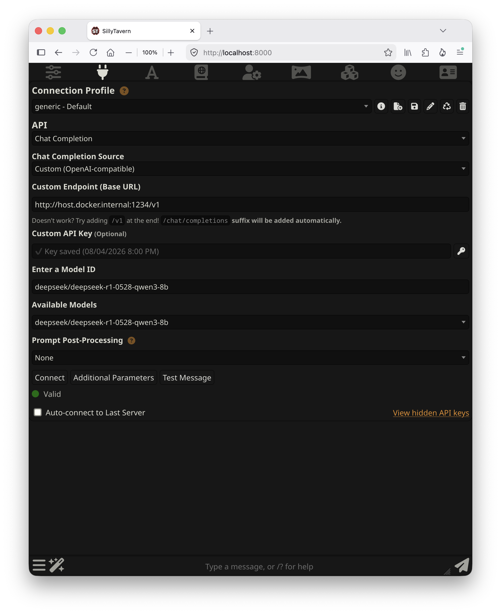
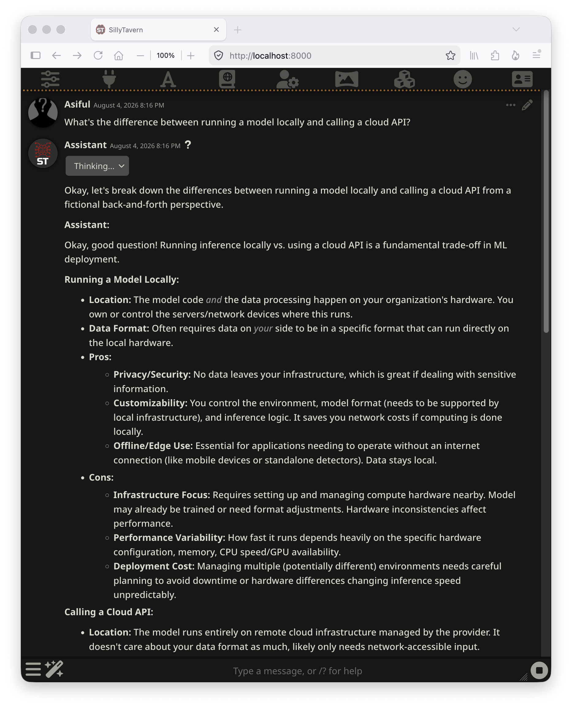

# SillyTavern

Character-driven chat. Personas, character cards, presets, and long-form roleplay — a different kind of interface to the other two, aimed at conversation with a character rather than queries against an assistant.

It's also the only service in this stack that won't run out of the box, for reasons worth understanding before you start.

> See the [main README](../README.md) for the canonical tested-on version matrix.

---

## Read this before starting it

SillyTavern ships with an IP whitelist permitting `127.0.0.1` and `::1` only. Inside a container, requests never arrive from those addresses — they come through Docker's NAT — so **a default install returns 403 to everything, including you.**

The error is convincing in the wrong direction:

```
Blocked connection from 172.x.x.x
To allow this connection, add its IP address to the whitelist or disable
whitelist mode by editing config.yaml in the root directory.
```

That points at `config.yaml`, which turns out to be correctly configured. The file lives at `/home/node/app/config/`, **outside the data mount**, so editing it means either entering the container or mounting over it. Neither is necessary — the settings are reachable as environment variables, which is what the Compose file here uses.

The second surprise follows immediately: turn the whitelist off and the app **refuses to start**.

```
Your current SillyTavern configuration is insecure (listening to non-localhost).
Enable whitelisting, basic authentication or user accounts.
```

Exit code 1. It won't let you expose it unprotected. That's a sound design decision, and it means basic authentication isn't optional here — it's the price of the container running at all.

---

## Start it

Credentials have no defaults in the Compose file, so the container won't start until you set them. Create a `.env` beside the Compose file:

```bash
cat > .env <<'ENVFILE'
SILLYTAVERN_USER=yourname
SILLYTAVERN_PASSWORD=choose-something-real
ENVFILE
```

The repo's ignore rules keep `.env` out of version control. If you'd rather not have the password sitting in a file, pass it in for one run instead:

```bash
read -rs "STPASS?SillyTavern password: "; echo
SILLYTAVERN_USER=yourname SILLYTAVERN_PASSWORD="$STPASS" docker compose up -d
unset STPASS
```

`read -rs` hides the input and keeps it out of shell history.

```bash
docker compose up -d
docker ps --filter name=sillytavern --format '{{.Names}}\t{{.Status}}'
```

Then open <http://localhost:8000> and authenticate with those credentials.

**Type `http://` explicitly.** Browsers with HTTPS-Only or HTTPS-First enabled will upgrade the request, and SillyTavern answers in plain HTTP — the result is a TLS parse error rather than a page.

Startup is fast, a few seconds. Nothing is downloaded on first boot.

---

## Connecting to the model server

Unlike the other two services here, this connection can't be set from the Compose file. It's entered in the UI and stored in the data directory.

Open **API Connections** — the plug icon in the top toolbar — and set:

| Field | Value |
|-------|-------|
| **API** | Chat Completion |
| **Chat Completion Source** | Custom (OpenAI-compatible) |
| **Custom Endpoint (Base URL)** | `http://host.docker.internal:1234/v1` |
| **Custom API Key** | Any value, e.g. `lm-studio` |
| **Enter a Model ID** | A model key, e.g. `deepseek/deepseek-r1-0528-qwen3-8b` |

Click **Connect**. The status line turns green and reads **Valid**, and **Available Models** fills with everything the model server is serving.



Two details worth knowing.

**The API key is labelled Optional but isn't.** Leave it blank and the field shows a red ✗ reading "Missing key" — the client won't send requests without one. The value is ignored; its presence isn't.

**Use `host.docker.internal`, not `localhost`.** Inside a container `localhost` is the container, so an endpoint pointing there fails while everything looks correctly configured. Docker Desktop supplies `host.docker.internal` on macOS automatically; the Compose file also declares it via `host-gateway` so the file works unchanged on Linux, where it isn't automatic. See [`../troubleshooting.md`](../troubleshooting.md).

### Reasoning models need a bigger response budget

The default response length is **300 tokens**, and that is not enough for a reasoning model. The thinking phase consumes the same allowance as the answer, so the budget runs out mid-thought and **no answer is ever produced**. The UI shows a "Thought for N seconds" block and nothing beneath it, which looks like a broken connection rather than a truncated response.

Raise the response length to **4,000 or more** in the sliders panel (first toolbar icon). Measured against the API, a reasoning model needed 2,150 tokens for a multi-step word problem and over 4,000 for an open-ended one — and a closed-form question with a one-line answer has consumed a full 4,000 elsewhere in this stack — so budget by whether the model reasons, not by how short the answer looks. See [`../benchmarks/`](../benchmarks/) for the measurements.

Note that this applies to more models than the obvious one. A multimodal model in this stack also reasons before answering, spending 77% of its budget doing so, and fails the same way under a tight limit.

The behaviour is verifiable directly — the same request returns an empty `content` at 300 tokens and a complete answer at a realistic budget:

```bash
curl -s http://localhost:1234/v1/chat/completions \
  -H "Content-Type: application/json" \
  -d '{"model":"<model-key>","messages":[{"role":"user","content":"Say hello in one sentence."}],"max_tokens":300}' \
  | jq '{content: .choices[0].message.content}'
```

Non-reasoning models don't need this, which is why it catches people out — the same setting works fine until you switch models.

---

## The interface



Every install ships with a sample character, so there's something to talk to immediately. Characters are portable card files that can be imported from the community formats SillyTavern supports; personas define who *you* are in the conversation, separately from the character.

The presets, prompt-manipulation controls, and instruct-mode templates are the reason to run this rather than Open WebUI. If you want to shape *how* a model responds — system prompt structure, response formatting, character consistency across a long conversation — the controls are here and they're granular. If you want to ask questions and get answers, [Open WebUI](../open-webui/) is the better fit and needs less setup.

---

## Configuration

| Variable | Default | Purpose |
|----------|---------|---------|
| `SILLYTAVERN_PORT` | `8000` | Host port |
| `SILLYTAVERN_DATA` | `./sillytavern-data` | Characters, chats, personas, presets |
| `SILLYTAVERN_NAME` | `sillytavern` | Container name |
| `SILLYTAVERN_USER` | *(required)* | Basic auth username |
| `SILLYTAVERN_PASSWORD` | *(required)* | Basic auth password |

Any config key can be overridden the same way. The transformation is mechanical — uppercase the key and replace dots with underscores, so `basicAuthUser.username` becomes `SILLYTAVERN_BASICAUTHUSER_USERNAME`. That's how the whitelist and authentication settings here are set without touching a file.

### The data directory

One bind mount holds everything: characters, chat history, personas, presets, settings, and the API connection you configured. Back up that directory and you've backed up your entire setup — the container holds no state of its own.

Which also means a container recreated with different environment variables keeps all of it. Changing the password or the port is `docker compose up -d` with a new value, not a migration.

---

## Managing the container

```bash
docker compose up -d
docker compose stop
docker compose down          # data survives in the bind mount
docker compose logs -f
docker compose pull && docker compose up -d
```

---

## Scope

This section covers running SillyTavern against a local model server: the whitelist and authentication requirements that make it start, the manual API connection, and the response-budget setting that reasoning models need. Character creation, prompt engineering, and extension configuration are large topics with good upstream documentation and are out of scope here.

<details>
<summary><b>On the security settings</b></summary>

The Compose file disables the IP whitelist and enables basic authentication. That trade is deliberate: the whitelist can't distinguish you from anyone else once requests arrive through Docker's NAT, so it blocks everything rather than protecting anything. A password authenticates.

The port is published to the host only. If you change that — binding to a network interface, putting it behind a tunnel, exposing it through a proxy — basic auth becomes the only thing standing between your setup and whoever can reach the port. Choose the password accordingly, and consider SillyTavern's multi-user accounts instead, which are a stronger mechanism than a single shared credential.

</details>
