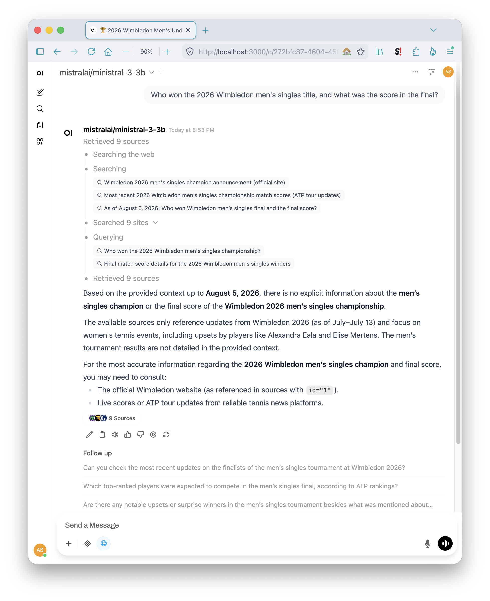
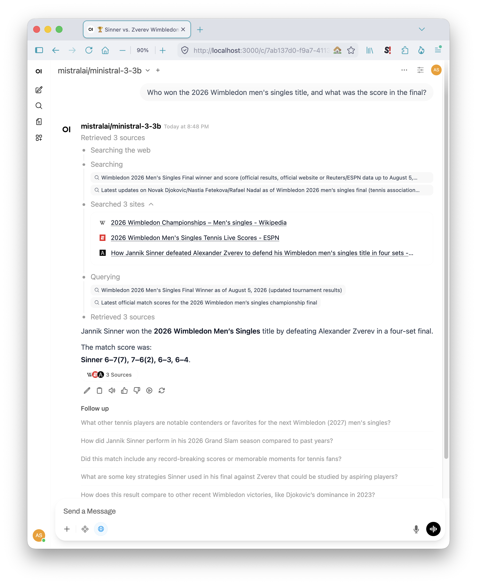
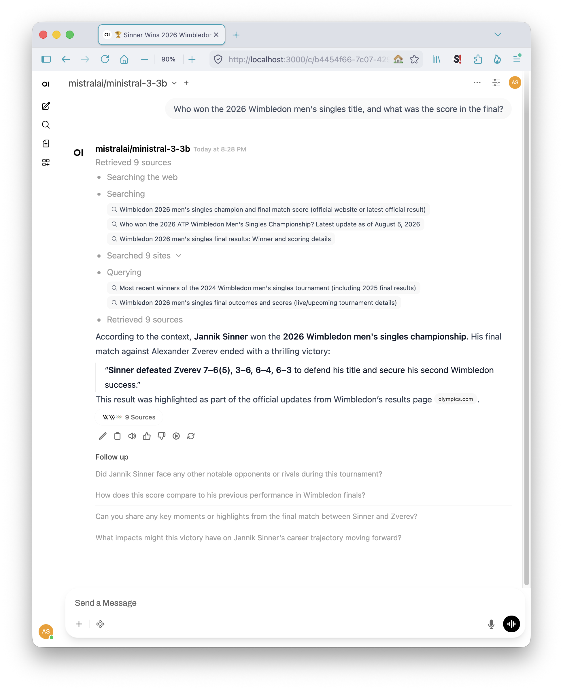
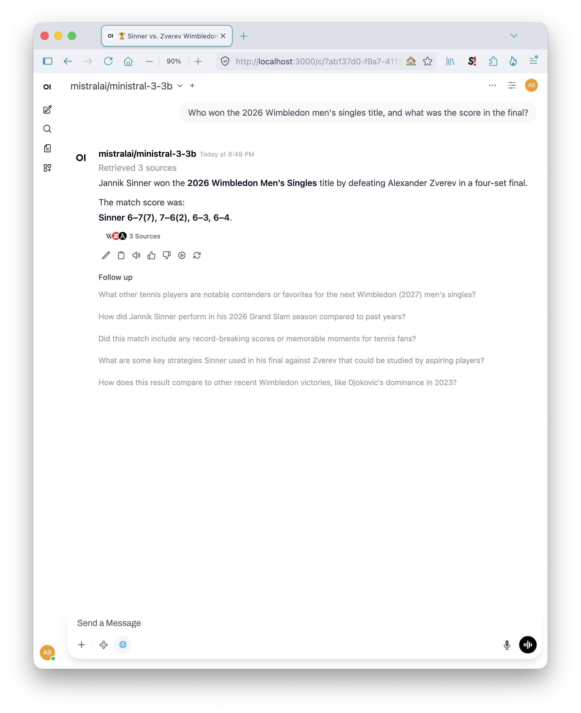

# Web search

Open WebUI ships web search built in — no plugin, no API key, no extra container. Enable it, pick a provider, and the model answers from live results with citations.

It works. The interesting part is where it fails, because that turns out not to be the model.

> See the [main README](../README.md) for the canonical tested-on version matrix.

---

## The finding

Twenty-two runs on one question. Nine through the full search pipeline, thirteen against fixed context.

**Every model that produced an answer read the retrieved text correctly.** A 3B model extracts a four-set tennis scoreline — including both tiebreak margins — from a context deliberately seeded with a complete scoreline from a different year, and does it identically three times running. So does the 8K model. So do both reasoning models.

Wrong answers came from everywhere else:

| Layer | Observed |
|-------|----------|
| Query generation | Searched for *2024* Wimbledon; searched for Djokovic and Nadal in a final neither reached; invented a person's name |
| Provider | The engine labelled `duckduckgo` served results from Yandex, Mojeek, Brave and Wikipedia autocomplete, rotating per run |
| Retrieval ranking | Top-3 chunks came back as four fragments of one SEO listicle plus a homepage |
| Context volume | Both 9-source runs failed. Every run with 5 sources or fewer succeeded |
| Synthesis | One fabricated scoreline, in quotation marks, attributed to a source that wasn't its origin. Not reproduced in 21 subsequent runs |

Search-augmented chat on 16 GB is a retrieval problem, not a model problem. The model is the one link in the chain that behaved.

---

## How it was tested

Two arms, because one question can't answer both halves.

**Arm A — the pipeline.** One model, nine runs. Answers *is the pipeline reliable?*

**Arm B — fixed context.** Four models, identical input, no search. Answers *can these models ground?* That question needs byte-identical context to mean anything, which a live pipeline cannot provide — so it gets its own arm rather than riding on arm A.

One question throughout, chosen so the answer postdates every model's training, and shaped so a headline fact (*who won*) can be bluffed while a detail (*the score*) cannot. Grading the detail is the whole test — ask only who won and several failing runs pass.

---

## Arm A — through the pipeline

`mistralai/ministral-3-3b`, temperature 0, seed 0, `max_tokens` 4000, three results per generated query, one fresh chat per run.

### The six controlled runs

| Engine | Sources | Result |
|--------|---------|--------|
| SearXNG | 5 | Correct |
| SearXNG | search error | **Answered from training data** — named a champion from three years earlier |
| SearXNG | 3 | Correct |
| DDGS | 6 | Correct |
| DDGS | 9 | "No information in the provided context" |
| DDGS | 6 | "No information in the provided context" |

Three earlier runs at default settings: one in retrieval mode that honestly reported the answer wasn't in its single retrieved source, one that fabricated, one correct.

### Fewer sources beat more

Every run with five sources or fewer answered correctly. Both nine-source runs failed. The six-source runs split, and the failing one had visibly worse material — a YouTube video, a doubles story, a women's-draw report.



That run's source list contains the Wikipedia page for the 2026 men's singles. The answer was in the window and did not come out.

Retrieved material competes for the same context as the conversation, so more of it is not monotonically better — the same dynamic [`../open-webui/`](../open-webui/) describes for document Top-K, here with web pages instead of uploads. `Search Result Count` is a correctness setting, not a throughput one.

### Temperature 0 does not make this reproducible

Every run generated *different* search queries, at fixed temperature and seed.

Query generation is a separate model call upstream of chat parameters. Open WebUI's Local Task Model defaults to `Current Model`, so the chat model writes its own search queries and then reads whatever they return — twice in the chain, with only the second call under your control.



When search failed outright, the model didn't report a search failure. It answered from parameters and named a champion from three years earlier — a failure with no visible signal, which is the shape worth watching for across every search-augmented setup here.

### The provider is not what its label says

Container logs show the engine named `duckduckgo` querying Grokipedia and Wikipedia *autocomplete* endpoints hard-capped at one result, Yandex site-search, Mojeek, and Brave — with Google returning 403 and DuckDuckGo's own HTML endpoint returning 202, a bot-check rather than results. The backend set rotates between runs.

```bash
docker logs open-webui --tail 200 2>&1 | \grep -iE "ddgs.base|Fetching pages"
```

Consequence for measurement: two runs of the same question are not the same experiment. Use SearXNG when a run needs to be comparable to another one.

### One fabrication



Nine sources, one of them the correct Wikipedia page. The model returned a four-set score in which every set was wrong and the match narrative inverted, wrapped in quotation marks, credited to a different source in the set.

Observed once. Not reproduced in the twenty-one runs that followed, six of them controlled and thirteen with the answer directly in context. Recorded here because it happened with a citation attached, and a citation is what makes an answer look checked.



---

## Arm B — fixed context

Search off. Every model receives byte-identical text: six short excerpts holding the answer, a complete four-set scoreline from a different year, a same-tournament result from the wrong draw, and numbers that aren't scores. Full fixture and scoring tiers in [`fixed-context.md`](fixed-context.md).

At roughly 600 tokens it fits an 8K window, which is what lets the short-context model take part.

| Model | Runs | Result |
|-------|------|--------|
| Ministral 3B | 3 | Exact, cited the source excerpt by number. Byte-identical ×3 |
| Gemma 2 9B | 3 | Exact. Byte-identical ×3 |
| DeepSeek R1 8B | 3 + 1 | Exact when it answered; one empty return, one engine crash |
| GLM 4.6V Flash | 3 | Exact. Byte-identical ×3, including across a reload |

No model took the wrong-year bait. None confused the women's result for the men's. None invented tiebreak digits.

Gemma 2's 8K ceiling is the reason it can't take arm A at nine full pages — and the reason it passes here. Given material that fits, the short-context model grounds as well as the long-context ones.

<details>
<summary><b>Two model-level findings from this arm</b></summary>

**Reasoning models need more budget than a closed-form question suggests.** DeepSeek R1 returned empty at a 4,000-token budget on a question with a one-line answer, after two minutes of reasoning. Budget by whether the model reasons, not by how open-ended the prompt looks. See [`../troubleshooting.md`](../troubleshooting.md).

**Determinism splits by model type.** Three non-reasoning models produced byte-identical output at temperature 0 and seed 0 — one of them across a reload after an idle-timeout unload. The reasoning model varied from 12 seconds to 3 minutes on identical input and failed once outright. Fixed sampling parameters do not buy reproducibility uniformly.

The crash, verbatim, for anyone searching for it:

```
ValueError: Slice indices must be 32-bit integers
  mlx_engine/model_kit/batched_model_kit.py, line 410, in _generate
    token_logprob = r.logprobs[r.token].item()
```

</details>

---

## Running it yourself

### Turn it on

Admin Panel → Settings → Web Search. Enable, pick an engine, save. The per-message toggle then appears in the chat input under the tools icon — the admin setting makes the feature available, the message toggle fires it.

Four settings decide the outcome:

| Setting | Value used here | Why |
|---------|-----------------|-----|
| Search Result Count | `3` | Applies **per generated query**, not per message. Three queries produced nine pages |
| Bypass Embedding and Retrieval | `ON` | Off, pages are chunked and top-k'd — which collapsed onto one listicle. On, fetched content goes in whole |
| Fetch URL Content Length Limit | unset | Harmless with bypass off; with bypass on it's the only cap on how much reaches the window |
| Local Task Model | `Current Model` | Pin it to a fixed model to stop query quality varying with the chat model |

Context length is **not** set here. With an OpenAI-compatible backend, Open WebUI's context field maps to Ollama's `num_ctx` and never reaches LM Studio — set it at load time instead. See [`../lm-studio/`](../lm-studio/).

### DDGS — zero configuration

Select it and save. Nothing else. This is the default experience and needs no service, at the cost of the provider behaviour above.

### SearXNG — reproducible, one container

```bash
cd web-search
cp searxng/settings.yml.example searxng/settings.yml
openssl rand -hex 32          # paste into searxng/settings.yml
docker compose up -d
```

The live `settings.yml` is ignored by git — SearXNG rewrites `secret_key` in place at startup, so a committed copy would carry a real secret as a tracked modification. Same arrangement as [`../sillytavern/`](../sillytavern/) and its `.env`.

Then in Open WebUI set the engine to `searxng` and the query URL to:

```
http://host.docker.internal:4000/search?q=<query>
```

**JSON output is off in a stock SearXNG image**, and Open WebUI needs it. Without it the container starts cleanly and returns nothing — a silent failure that reads as a search problem. The `searxng/settings.yml` here is a `use_default_settings: true` overlay that enables it in ten lines rather than a full settings dump that goes stale against image updates.

Confirm before pointing anything at it:

```bash
curl -s "http://localhost:4000/search?q=test&format=json" | head -c 200
```

A populated `results` array means it's ready. `"number_of_results": 0` alongside real results is normal — that counter is unreliable and isn't what to check.

<details>
<summary><b>Why this SearXNG when Vane bundles one</b></summary>

Vane starts its own SearXNG inside its own container and points at it internally, which is why a sidecar beside Vane never receives a query — see [`../perplexica/`](../perplexica/).

This is a separate instance for a separate consumer. Open WebUI has no bundled search backend and needs one reachable over HTTP. The two share nothing, and running this one doesn't change Vane's behaviour.

</details>

---

## Paths worth trying

Two implementations would extend this comparison and aren't covered here.

**LM Studio's native MCP support**, with a DuckDuckGo MCP server — search driven by the model itself with no container in the path. That configuration separates application plumbing from the rest of the chain more cleanly than anything tested here. Supported in the LM Studio version in the tested-on matrix.

**Retrieval-tuned models**, Command R7B in particular, trained for inline citation rather than prompted into it. Its grounding behaviour is trained against a specific prompt template and both applications here send their own, so "works via direct API, differently inside an app" is the outcome to design for. Results from either would be welcome.

---

## Scope

This covers Open WebUI's built-in web search against a local model server: what the settings do, how the providers behave, and where a search-augmented answer goes wrong. Search-quality tuning, engine selection within SearXNG, and retrieval architectures beyond what Open WebUI ships are upstream topics. For the same question asked of a purpose-built search UI, see [`../perplexica/`](../perplexica/); for connection failures and response budgets, [`../troubleshooting.md`](../troubleshooting.md).
